## Author

**Tristan Patout**  
Master's student in Computer Science - Artificial Intelligence at Université Côte d'Azur.  
This project was developed as part of the Software Engineering course led by J-C Régin.

## How to Use the Sudoku Solver

This Sudoku Solver is designed to help you solve Sudoku puzzles using various deduction techniques. 
Follow the steps below to use the program:

1. **Clone the Repository**:
    ```sh
    git clone https://github.com/3ST1/sudoku_solver.git
    cd sudoku_solver
    ```

2. **Install Dependencies**:
    Ensure you have a Python version 3.9 or older (normally there are no other required dependencies to install). You can use the following command to check your Python version:
    ```sh
    python --version # Should be Python 3.9 or older
    ```

3. **Run the Solver**:
    You can run the solver by executing the main script. For example:
    ```sh
    python main.py 
    # You can also specify the input file, verbosity, and if you want to prompt the user for input
    python main.py --input "path_to_the_input_file" --verbose "True" --prompt_user "False"
    ```

    - `--input`: Path to the input file containing the Sudoku puzzle.
    - `--verbose`: Set to `True` if you want to see the steps taken to solve the puzzle. Default is `False`.
    - `--prompt_user`: Set to `False` if you do not want to be prompted when grid is stuck. Default is `True`.

4. **Default Input File**:
    If you do not specify an input file, the solver will use the default input file `grids/input.txt` ([input.txt](grids/input.txt)).
    You can use this file to test the solver with different puzzles.
    Just edit the file and replace the puzzle with your own respecting the format described below.

5. **Input Format**:
    The input file should contain the Sudoku puzzle with each row separated by a newline and each cell separated by a comma. Use `0` to represent empty cells.
    For example:
    ```
    1,8,0,0,0,0,5,6,9
    4,0,2,0,0,0,0,0,8
    0,5,0,0,0,9,0,4,0
    0,0,0,6,4,0,8,0,1
    0,0,0,0,1,0,0,0,0
    2,0,8,0,3,5,0,0,0
    0,4,0,5,0,0,0,1,0
    9,0,0,0,0,0,4,0,2
    6,2,1,0,0,0,0,0,5
    ```

6. **Understanding the Output**:
    The solver will print the solved Sudoku grid to the console. If verbose mode is enabled, it will also display the steps taken to solve the puzzle. If prompt mode is enabled, it will prompt you to to enter a row index, column index and value to avance the solver.

7. **Customization**:
    You can customize the solver by modifying the deduction rules or adding new rules. Refer to the class diagram and the code for more details on how to extend the functionality.
    You basically need to create a new class that extends the `DeductionRule` class ([DeductionRule](src/DeductionRule.py)) and implement the `_apply_rule` method. Then, add the new rule to the `DeductionRuleFactory` dictionary `RULES` ([DeductionRuleFactory](src/DeductionRuleFactory.py)).

8. **Testing**:
    You can run the tests to ensure the solver is working correctly by running the file `run_tests.py` ([run_tests.py](run_tests.py)).
    Use the following command:
    ```sh
    python "./run_tests.py"
    ```


Feel free to explore the code and contribute to the project by submitting pull requests or reporting issues.

Happy Solving!

## Class Diagram

```mermaid
classDiagram

    note for DR1 "Naked Techniques Base Class"
    note for DR1_1 "Naked Single"
    note for DR1_2 "Naked Pair"
    note for DR1_3 "Naked Triple"
    note for DR2 "Hidden Techniques Base Class"
    note for DR2_1 "Hidden Single"
    note for DR2_2 "Hidden Pair"
    note for DR2_3 "Hidden Triple"
    note for DR3 "Y-Wing"
    class SudokuSolver {
        +SudokuGrid sudoku_grid
        +List<DeductionRule> rules
        +RulesHandlerChain rules_chain
        +int difficulty
        +boolean prompt_user
        +boolean verbose
        +solve() : boolean
        +apply_rule(rule: DeductionRule) : boolean
        +prompt_user_for_input() : void
    }

    class SudokuGrid {
        +List<List<Cell>> rows
        +List<List<Cell>> cols
        +List<List<Cell>> zones
        +get_cell(row_idx: int, col_idx: int) : Cell
        +is_complete() : boolean
        +is_correct() : boolean
        +print_grid() : void
        +show_notes() : void
        +compute_cell_notes() : void
        +get_possible_values(cell: Cell) : Set<int>
    }

    class Cell {
        +int val
        +Set<int> notes
        +int row_idx
        +int col_idx
        +int zone_idx
        +CellObserver observer
    }

    class CellObserver {
        +Cell cell
        +grid: SudokuGrid
        +row: Set<Cell>
        +col: Set<Cell>
        +zone: Set<Cell>
        +related_cells: Set<Cell>
        +update_cells() : void
        +observed_cells() : Set<Cell>
    }

    class DeductionRule {
        +name: String
        +difficulty: int
        +has_changed: boolean
        +get_name() : String
        +get_difficulty() : int
        +apply_rule(grid: SudokuGrid, verbose: boolean) : boolean
    }

    class DR1 {
        -_apply_rule(grid: SudokuGrid) : void
        -_apply_naked_rule(group: List<List<Cell>>) : void
    }

    class DR1_1 {
        -_apply_rule(grid: SudokuGrid) : void
    }

    class DR1_2 {
        -_apply_rule(grid: SudokuGrid) : void
        +find_naked_pairs(cells: List<Cell>) : List<tuple<Cell, Cell>>
    }

    class DR1_3 {
        -_apply_rule(grid: SudokuGrid) : void
        +find_naked_triples(cells: List<Cell>) : List<tuple<Cell, Cell, Cell>>
    }

    class DR2 {
        -_apply_rule(grid: SudokuGrid) : void
        +get_notes_occurences(group: List<Cell>) : Dictionary<int, Set<Cell>>
    }

    class DR2_1 {
        -_apply_rule(grid: SudokuGrid) : void
        +apply_hidden_rule(note_occurences: Dictionary<int, Set<Cell>>) : void
    }

    class DR2_2 {
        -_apply_rule(grid: SudokuGrid) : void
        +apply_hidden_rule(note_occurences: Dictionary<int, Set<Cell>>) : void
    }

    class DR2_3 {
        -_apply_rule(grid: SudokuGrid) : void
        +apply_hidden_rule(note_occurences: Dictionary<int, Set<Cell>>) : void
    }

    class DR3 {
        -_apply_rule(grid: SudokuGrid) : void
        +apply_y_wing(grid: SudokuGrid) : void
    }

    class DeductionRuleFactory {
        +Dictionary<String, DeductionRule> RULES
        +create_rule(rule_name: String) : DeductionRule
        +create_all_rules() : List<DeductionRule>
    }

    class RulesHandlerChain {
        +first_handler: DeductionRule
        +last_handler: DeductionRule
        +add_handler(handler: RuleHandler) : void
        +execute(grid: SudokuGrid, difficulty: boolean, verbose: boolean) : tuple[bool, int]
    }

    class RuleHandler {
        +rule: DeductionRule
        +next_handler: RuleHandler
        +handle(grid: SudokuGrid, difficulty: boolean, verbose: boolean) : tuple[bool, int]
    }

    SudokuSolver --> SudokuGrid : uses
    SudokuSolver --> DeductionRule : applies (Chain of Responsibility)
    SudokuSolver --> DeductionRuleFactory : creates rules (Factory)
    SudokuSolver --> RulesHandlerChain : uses (Chain of Responsibility)

    SudokuGrid --> Cell : contains
    Cell --> SudokuGrid : contains
    DeductionRule --> Cell : updates Cell
    Cell --> CellObserver : contains
    CellObserver --> Cell : observes and updates

    DeductionRule <|-- DR1 : implements
    DR1 <|-- DR1_1 : implements
    DR1 <|-- DR1_2 : implements
    DR1 <|-- DR1_3 : implements
    DeductionRule <|-- DR2 : implements
    DR2 <|-- DR2_1 : implements
    DR2 <|-- DR2_2 : implements
    DR2 <|-- DR2_3 : implements
    DeductionRule <|-- DR3 : implements

    RulesHandlerChain --> RuleHandler : contains
    RulesHandlerChain --> SudokuSolver : applied by


```	


## License
This project is licensed under the MIT License - see the [LICENSE](LICENSE) file for details.